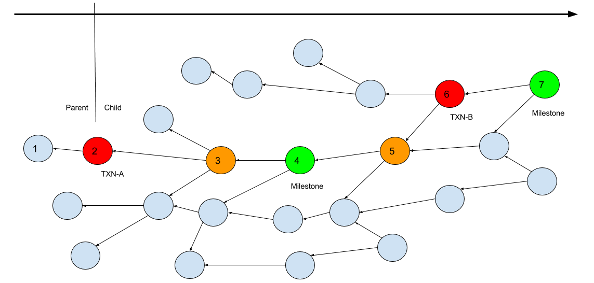

# Get IOTA transaction depth

According the schematic diagram as below, this tool will:



1. Give a specific IOTA transaction (TXN-A)
2. List all child transactions: txn(3), txn(4)
3. Get the approved milestone transaction: txn(5)
4. Calculate (A) IRI-depth: the depth from txn(7) to txn(4)

#### Example:
1. Modify the specific transaction hash on `get_txn_deep.py`: 
   ``` hash_transatcion = "SJXZIEIUAEIITGZEZGAGRMCFNFLYVAFC9NPQPOEP9KPGMH9UHDAXZIUD9CMRD9RXSMMVGZUDORX999999" ```
2. Run it
   ``` $ python3 get_txn_deep.py ```
3. Output
   - Get milestone transaction hash: ``` UZDVF9WDTPDIFAVSBXPMYWWHKQIVG9GCTMKFIBVYCZRQRRAJBONYWINLAPUOIVPCDQBKLKITIZDJZ9999 ```
   - Get IRI-depth: 66878

   ```
   11-10 21:17 Child transaction: KHOFZNIEQWWQWJADRUIUSVUDMVCWENNTJJDXBHHLLQFPSZJJSVYHFWHSDVQDHQGMIVFDBJYDSPGRZ9999
   11-10 21:17 Child transaction: RLJERCILNQZHFATGGSFZBVLUIGK9MQ9NWAZSWZBTMQDYXX9JMREONKAHGKYZ9GKWFXLRSOLCKHYP99999
   11-10 21:17 Child transaction: NALPIFMFGZTACWPLRWLBSPVJTIXAQSLLUPGY9SVRDCMICHBKGHHTHDLAOMFDTJXWGTS9VKTLDYZW99999
   11-10 21:17 Child transaction: DEOOYMFPSFXZAMYWQWLZBJZMUM9ECRVQOZIHGOXCXULZZAOYXTDNFZYIXAMASMHBNDORKPKMI9DWA9999
   11-10 21:17 Child transaction: UZDVF9WDTPDIFAVSBXPMYWWHKQIVG9GCTMKFIBVYCZRQRRAJBONYWINLAPUOIVPCDQBKLKITIZDJZ9999
   IRI depth: 66878
   ```
